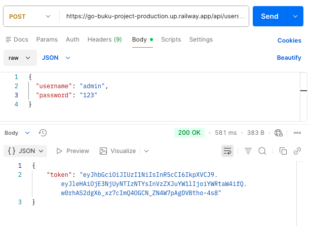
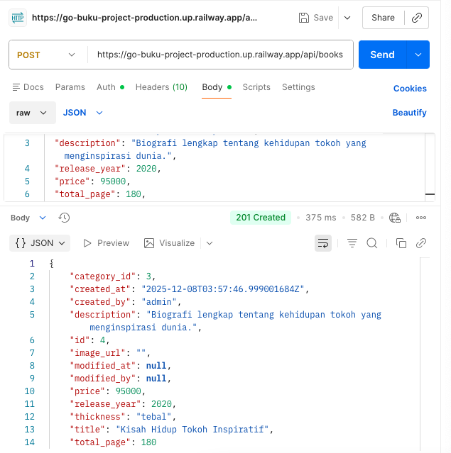
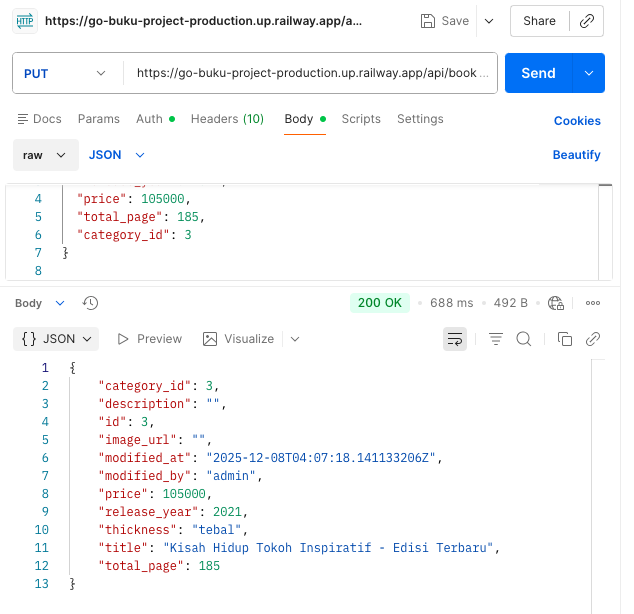
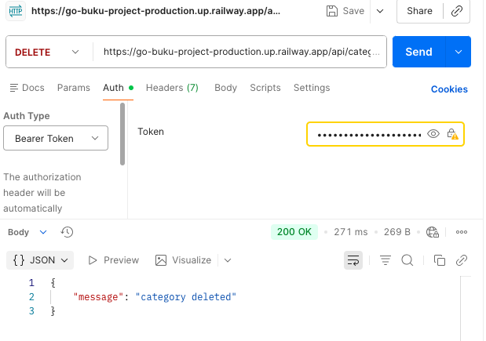

# Go Buku Project

## Deskripsi
Mini project ini dibuat menggunakan **Golang** untuk input dan manajemen data buku serta kategorinya.  
Database yang digunakan adalah **PostgreSQL/MySQL** dan project ini sudah siap untuk **deployment di Railway**.  

Fitur utama:
- Authentication menggunakan **Basic Auth** atau **JWT**
- CRUD untuk **Kategori Buku** (`api/categories`)
- CRUD untuk **Buku** (`api/books`) dengan logika khusus untuk `thickness` berdasarkan `total_page`
- Validasi input, termasuk `release_year` (1980 - 2024)
- Error handling untuk data yang tidak ditemukan

---

## Struktur Project
go-buku-project/
│
├─ controllers/
│ ├─ book_controller.go
│ ├─ category_controller.go
│ └─ user_controller.go
├─ database/
│ └─ database.go
├─ middlewares/
│ ├─ auth_basic.go
│ └─ auth_jwt.go
├─ migrations/
│ ├─ 001_create_users.sql
│ ├─ 002_create_categories.sql
│ └─ 003_create_books.sql
├─ models/
│ ├─ book.go
│ ├─ category.go
│ └─ user.go
├─ repositories/
│ ├─ book_repo.go
│ ├─ category_repo.go
│ └─ user_repo.go
├─ routers/
│ └─ router.go
├─ go.mod
├─ go.sum
└─ main.go

---

## Database Design

### Tabel Buku
| Kolom        | Tipe       | Keterangan |
|--------------|------------|------------|
| id           | integer    | Primary Key |
| title        | varchar    | Required |
| description  | varchar    | Optional |
| image_url    | varchar    | Optional |
| release_year | integer    | 1980 - 2024 |
| price        | integer    | Required |
| total_page   | integer    | Required |
| thickness    | varchar    | "tebal" jika total_page > 100, "tipis" jika <= 100 |
| category_id  | integer    | Foreign key kategori (nullable) |
| created_at   | timestamp  | Auto set saat insert |
| created_by   | varchar    | User creator |
| modified_at  | timestamp  | Nullable |
| modified_by  | varchar    | Nullable |

### Tabel Kategori
| Kolom        | Tipe       |
|--------------|------------|
| id           | integer    |
| name         | varchar    |
| created_at   | timestamp  |
| created_by   | varchar    |
| modified_at  | timestamp  |
| modified_by  | varchar    |

### Tabel User
| Kolom        | Tipe       |
|--------------|------------|
| id           | integer    |
| username     | varchar    |
| password     | varchar    |
| created_at   | timestamp  |
| created_by   | varchar    |
| modified_at  | timestamp  |
| modified_by  | varchar    |

---

## API Endpoints

### Authentication

**Login (JWT)**  
POST /api/users/login
Body:
{
"username": "user1",
"password": "password123"
}
Response:
{
"token": "eyJhbGciOiJIUzI1NiIsInR5cCI6IkpXVCJ9..."
}

> Semua route kategori dan buku harus menggunakan **JWT token** atau **Basic Auth**.

---

### Kategori

| Method | Path | Deskripsi | 
|--------|------|-----------|
| GET    | /api/categories | Menampilkan semua kategori | 
| POST   | /api/categories | Menambahkan kategori baru | 
| GET    | /api/categories/:id | Menampilkan detail kategori | 
| DELETE | /api/categories/:id | Menghapus kategori | 
| GET    | /api/categories/:id/books | Menampilkan buku berdasarkan kategori | 
| PUT    | /api/categories/:id | Mengupdate kategori | 

---

### Buku

| Method | Path | Deskripsi |
|--------|------|-----------|
| GET    | /api/books | Menampilkan semua buku |
| POST   | /api/books | Menambahkan buku baru | 
| PUT    | /api/books/:id | Mengaupdate buku |
| GET    | /api/books/:id | Menampilkan detail buku |
| DELETE | /api/books/:id | Menghapus buku |

#### Validasi & Logika
- Middleware **Basic Auth / JWT** wajib untuk semua route kategori dan buku.
- Error message diberikan saat menghapus atau update data yang tidak ditemukan.
- `release_year` hanya menerima input **1980 - 2024**.
- `thickness` otomatis diisi berdasarkan `total_page`:
  - `total_page > 100` → `"tebal"`
  - `total_page <= 100` → `"tipis"`

---

## Deployment
Project siap dideploy ke **Railway**.  
Langkah umum:
1. Buat project di Railway dan hubungkan repository GitHub.  
2. Set environment variable untuk database.  
3. Jalankan migration SQL untuk membuat tabel.  
4. Deploy project.  

---

## Cara Penggunaan
1. Clone repository:
git clone <repo_url>
cd go-buku-project

---

## Database Design
go mod tidy

## Jalankan server:
go run main.go

## Akses API menggunakan Postman atau curl

## Access Control / Endpoint Permissions

| Method | Path | Deskripsi | Access |
|--------|------|-----------|--------|
| GET    | /api/categories | Menampilkan semua kategori | Public |
| GET    | /api/categories/:id | Menampilkan detail kategori | Public |
| GET    | /api/categories/:id/books | Menampilkan buku berdasarkan kategori | Public |
| GET    | /api/books | Menampilkan semua buku | Public |
| GET    | /api/books/:id | Menampilkan detail buku | Public |
| POST   | /api/users/login | Login untuk mendapatkan JWT token | Protected |
| POST   | /api/categories | Menambahkan kategori baru | Protected |
| DELETE | /api/categories/:id | Menghapus kategori | Protected |
| POST   | /api/books | Menambahkan buku baru | Protected |
| PUT   | /api/categories/:id | Mengupdate Kategori | Protected |
| PUT   | /api/books/:id | Mengupdate Buku | Protected |
| DELETE | /api/books/:id | Menghapus buku | Protected |

💡 Keterangan:

Public: bisa diakses tanpa token (langsung dari URL Railway atau localhost).

Protected: harus menyertakan JWT token atau Basic Auth di header:

Authorization: Bearer <token>

### Contoh Screenshot Postman

**Login**

**GET**

**POST Buku Baru**

**PUT Buku**

**DELETE Buku Baru**

